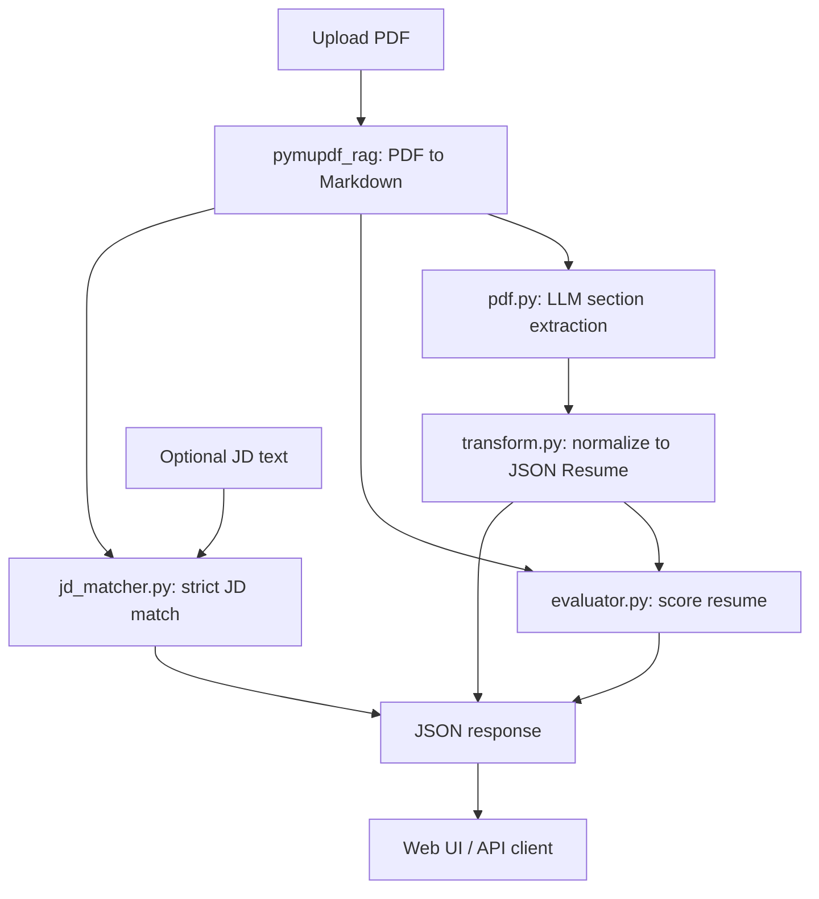

# ATS Hiring Agent

AI-powered Applicant Tracking System that parses resume PDFs, scores candidates with explainable rubrics, and optionally matches resumes against job descriptions — all through a modern web UI and REST API.

Built with **FastAPI**, **PyMuPDF**, and **LLM-backed extraction** (Ollama locally or Nebius AI Studio in the cloud). Every prompt lives in version-controlled Jinja templates so scoring behavior is transparent and easy to tune.

---

## Table of contents

- [Features](#features)
- [How it works](#how-it-works)
- [Project structure](#project-structure)
- [Prerequisites](#prerequisites)
- [Installation](#installation)
- [Configuration](#configuration)
- [Running the application](#running-the-application)
- [Using the web UI](#using-the-web-ui)
- [Scoring system](#scoring-system)
- [Job description matching](#job-description-matching)
- [API reference](#api-reference)
- [Customizing prompts](#customizing-prompts)
- [LLM providers](#llm-providers)
- [Troubleshooting](#troubleshooting)

---

## Features

### Web interface

- Drag-and-drop PDF upload (max 10 MB by default)
- Optional job description field for JD-aware matching
- Tabbed results: **Overview**, **JD Match**, **Resume Details**
- Responsive layout for desktop and mobile

### Resume evaluation

- PDF → Markdown extraction via `pymupdf_rag`
- Section-by-section JSON parsing (basics, work, education, skills, projects, awards)
- Four category scores with written evidence per category
- Bonus points and deductions with breakdowns
- Key strengths and areas for improvement
- Final score on a **1–100** ATS scale (normalized from the internal rubric)

### Job description matching

- Strict, evidence-based match scoring (0–100%)
- Skill match, experience match, and keyword match percentages
- Matched vs missing skills with confidence levels
- Strengths, gaps, and actionable recommendations
- Mandatory score caps when required skills or experience are absent

### Production-ready defaults

- Environment-based configuration (`.env`)
- Temporary file handling — uploads are not persisted on disk
- CORS, log level, and file size limits configurable
- Health check endpoint for monitoring

---

## How it works



1. **Extract text** — The PDF is converted to structured Markdown text.
2. **Parse sections** — The LLM extracts each resume section using dedicated Jinja prompts.
3. **Normalize** — Raw LLM output is transformed into [JSON Resume](https://jsonresume.org/) format.
4. **Evaluate** — A separate prompt scores open source, projects, production experience, and technical skills.
5. **Match JD** *(optional)* — If a job description is provided, a strict matcher compares resume vs JD.
6. **Respond** — Results are returned as JSON and rendered in the browser.

---

## Project structure

```
hiring-agent/
├── app.py                          # FastAPI entry point and API routes
├── services/                       # Core business logic
│   ├── __init__.py
│   ├── config.py                   # Environment settings (HOST, PORT, CORS, etc.)
│   ├── pdf.py                      # PDF extraction and section parsing
│   ├── evaluator.py                # Resume scoring engine
│   ├── jd_matcher.py               # Job description matcher
│   ├── models.py                   # Pydantic schemas and LLM provider classes
│   ├── llm_utils.py                # Provider initialization and JSON cleanup
│   ├── prompt.py                   # Model names, provider mapping, parameters
│   ├── transform.py                # LLM JSON → JSON Resume normalization
│   └── pymupdf_rag.py              # PDF-to-Markdown conversion
├── prompts/
│   ├── template_manager.py         # Jinja template loader and renderer
│   └── templates/
│       ├── basics.jinja            # Section extraction prompts
│       ├── work.jinja
│       ├── education.jinja
│       ├── skills.jinja
│       ├── projects.jinja
│       ├── awards.jinja
│       ├── system_message.jinja
│       ├── resume_evaluation_criteria.jinja
│       ├── resume_evaluation_system_message.jinja
│       ├── jd_matching_criteria.jinja
│       └── jd_matching_system_message.jinja
├── templates/
│   └── index.html                  # Single-page web UI
├── requirements.txt
├── .env.example                    # Environment variable template
└── README.md
```

---

## Prerequisites

| Requirement | Notes |
|-------------|-------|
| **Python 3.11+** | Tested with 3.11 and 3.12 |
| **LLM provider** | [Ollama](https://ollama.com/) (local) **or** [Nebius AI Studio](https://nebius.com/) (cloud API key) |
| **Ollama models** | Pull at least one supported model (e.g. `gemma3:4b`) |
| **Nebius** | API key from Nebius AI Studio if using cloud models |

---

## Installation

### 1. Clone and enter the project

```bash
git clone <repository-url>
cd hiring-agent
```

### 2. Create a virtual environment

```bash
python -m venv .venv

# Windows
.venv\Scripts\activate

# macOS / Linux
source .venv/bin/activate
```

### 3. Install dependencies

```bash
pip install -r requirements.txt
```

### 4. Configure environment

```bash
# Windows
copy .env.example .env

# macOS / Linux
cp .env.example .env
```

Edit `.env` with your LLM provider and settings (see [Configuration](#configuration)).

### 5. Pull an Ollama model (local setup)

```bash
ollama pull gemma3:4b
```

Set in `.env`:

```env
LLM_PROVIDER=ollama
DEFAULT_MODEL=gemma3:4b
```

---

## Configuration

All settings are loaded from `.env` via `python-dotenv`. See `.env.example` for the full template.

### Server settings

| Variable | Default | Description |
|----------|---------|-------------|
| `HOST` | `0.0.0.0` | Bind address |
| `PORT` | `5000` | Server port |
| `DEBUG` | `false` | Enables debug log level when `true` |
| `LOG_LEVEL` | `INFO` | Python logging level (`DEBUG`, `INFO`, `WARNING`, `ERROR`) |
| `OPEN_BROWSER` | `false` | Auto-open browser when running `python app.py` |
| `MAX_FILE_SIZE` | `10485760` | Max upload size in bytes (10 MB) |
| `CORS_ORIGINS` | `*` | Comma-separated allowed origins, or `*` for all |

### LLM settings

| Variable | Default | Description |
|----------|---------|-------------|
| `LLM_PROVIDER` | `ollama` | `ollama` or `nebius` |
| `DEFAULT_MODEL` | `gemma3:4b` | Model identifier for your provider |
| `NEBIUS_API_KEY` | — | Required when `LLM_PROVIDER=nebius` |

### Supported models

Configured in `services/prompt.py`:

**Ollama:** `gemma3:4b`, `gemma3:12b`, `gemma3:1b`, `qwen3:4b`, `qwen3:1.7b`, `mistral:7b`

**Nebius:** `google/gemma-3-27b-it`, `google/gemma-3-12b-it`, `meta-llama/Meta-Llama-3.1-70B-Instruct`, `meta-llama/Meta-Llama-3.1-8B-Instruct`, `mistralai/Mistral-Nemo-Instruct-2407`

Model-specific temperature and `top_p` values are defined in `MODEL_PARAMETERS` inside `services/prompt.py`.

---

## Running the application

### Recommended (production)

```bash
python -m uvicorn app:app --host 0.0.0.0 --port 5000
```

### Development (with auto browser)

```bash
# Set in .env: DEBUG=true, OPEN_BROWSER=true
python app.py
```

### Access points

| URL | Description |
|-----|-------------|
| http://localhost:5000 | Web UI |
| http://localhost:5000/docs | Swagger API documentation |
| http://localhost:5000/redoc | ReDoc API documentation |
| http://localhost:5000/api/health | Health check |

---

## Using the web UI

1. Open http://localhost:5000
2. **Upload** a resume PDF (drag-and-drop or click to browse)
3. *(Optional)* Paste a **job description** in the text area
4. Click **Upload & Evaluate**
5. Review results in the tabs:
   - **Overview** — Final score, category breakdown with evidence, strengths, improvements, bonuses, deductions
   - **JD Match** — Match percentages, skill analysis, gaps, recommendations *(only when JD is provided)*
   - **Resume Details** — Parsed personal info, work, education, skills, projects

Evaluation typically takes 30–90 seconds depending on model speed and resume length.

---

## Scoring system

The evaluator assigns scores across four categories. Scoring rules and fairness constraints are defined in `prompts/templates/resume_evaluation_*.jinja`.

| Category | Max points | What it measures |
|----------|------------|------------------|
| **Open Source** | 35 | Contributions to others' projects, GSoC, community involvement |
| **Self Projects** | 30 | Personal/hackathon project complexity and impact |
| **Production** | 25 | Work, internship, and real-world experience |
| **Technical Skills** | 10 | Breadth and depth of technical skills |

Additional adjustments:

- **Bonus points** — up to **+20** (e.g. prestigious programs, exceptional projects)
- **Deductions** — subtracted from total (e.g. missing links, tutorial-only projects)

**Final score (displayed)** = normalized to **1–100** from the internal rubric total (categories + bonus − deductions, max 120). Category breakdowns still show their original point values (e.g. open source /35).

### Fairness

Scores intentionally ignore name, gender, university, GPA, and location. Evaluation is based only on demonstrated technical skills, projects, and experience.

---

## Job description matching

When a job description is supplied, `JDMatcher` runs a **strict, evidence-based** comparison. Prompts live in:

- `prompts/templates/jd_matching_system_message.jinja` — scoring philosophy and caps
- `prompts/templates/jd_matching_criteria.jinja` — analysis instructions and JSON schema

### Match outputs

| Field | Description |
|-------|-------------|
| `match_score` | Overall fit (0–100), with mandatory caps for missing requirements |
| `skill_match_percentage` | % of required JD skills found in resume |
| `experience_match` | Alignment of years, seniority, and role type |
| `keyword_match_percentage` | % of important JD keywords present in resume |
| `matched_skills` / `missing_skills` | Per-skill analysis with importance and confidence |
| `matched_keywords` | Shared terms with frequency counts |
| `strengths` / `gaps` / `recommendations` | Actionable feedback |

### Strict scoring rules (summary)

- No credit for implied or assumed skills — only explicit resume evidence counts
- Missing any required skill caps overall match at **65**
- Missing more than half of required skills caps match at **45**
- Experience below JD minimum caps experience match at **40** and overall at **55**
- Scores above **70** require strong, documented proof

---

## API reference

### `GET /`

Serves the web UI (`templates/index.html`).

---

### `GET /api/health`

Health check for load balancers and monitoring.

**Response:**

```json
{
  "status": "healthy",
  "service": "ATS Hiring Agent API",
  "timestamp": "2026-06-05T12:00:00.000000"
}
```

---

### `POST /api/evaluate`

Evaluate a resume PDF. Optionally include a job description for JD matching.

**Content-Type:** `multipart/form-data`

| Field | Type | Required | Description |
|-------|------|----------|-------------|
| `file` | file | Yes | PDF resume (`.pdf` only) |
| `job_description` | string | No | Job description text for JD matching |

**Example (curl):**

```bash
curl -X POST http://localhost:5000/api/evaluate \
  -F "file=@resume.pdf" \
  -F "job_description=We are looking for a Python developer with FastAPI experience..."
```

**Success response (`200`):**

```json
{
  "success": true,
  "file_name": "resume.pdf",
  "evaluation": {
    "final_score": 53,
    "raw_score": 63,
    "category_scores": {
      "open_source": { "score": 8, "max": 35, "evidence": "..." },
      "self_projects": { "score": 22, "max": 30, "evidence": "..." },
      "production": { "score": 18, "max": 25, "evidence": "..." },
      "technical_skills": { "score": 8, "max": 10, "evidence": "..." }
    },
    "bonus_points": { "total": 5, "breakdown": "..." },
    "deductions": { "total": 0, "reasons": "..." },
    "key_strengths": ["...", "..."],
    "areas_for_improvement": ["...", "..."]
  },
  "resume_data": {
    "basics": { "name": "...", "email": "..." },
    "work": [],
    "education": [],
    "skills": [],
    "projects": []
  },
  "jd_match": null
}
```

When a job description is provided, `jd_match` contains the full match object (scores, skills, gaps, recommendations). When omitted, `jd_match` is `null`.

**Error responses:**

| Status | Cause |
|--------|-------|
| `400` | Invalid file type or unreadable PDF |
| `413` | File exceeds `MAX_FILE_SIZE` |
| `500` | Processing or LLM error |

---

## Customizing prompts

All LLM instructions are in Jinja templates under `prompts/templates/`. Edit these files to change scoring behavior — no Python changes required for most tuning.

| Template | Purpose |
|----------|---------|
| `basics.jinja` … `awards.jinja` | Resume section extraction |
| `system_message.jinja` | Extraction system message |
| `resume_evaluation_criteria.jinja` | Scoring rubric and JSON schema |
| `resume_evaluation_system_message.jinja` | Evaluation system message and fairness rules |
| `jd_matching_criteria.jinja` | JD match user prompt |
| `jd_matching_system_message.jinja` | JD match strict scoring rules |

Templates are loaded by `prompts/template_manager.py` using absolute paths, so they work regardless of the working directory.

After editing templates, restart the server to pick up changes.

---

## LLM providers

### Ollama (local, default)

- Free, runs on your machine
- Set `LLM_PROVIDER=ollama` and `DEFAULT_MODEL` to a pulled model
- Ensure Ollama is running: `ollama serve`

### Nebius AI Studio (cloud)

- Set `LLM_PROVIDER=nebius`
- Set `NEBIUS_API_KEY` in `.env`
- Set `DEFAULT_MODEL` to a Nebius-supported model (e.g. `google/gemma-3-27b-it`)
- Uses OpenAI-compatible API via the `openai` Python package

If Nebius is selected but no API key is set, the system falls back to Ollama with a warning in the logs.

---

## Troubleshooting

### `Failed to extract text from PDF`

The PDF may be scanned/image-only. Use a PDF with selectable text, or run OCR before upload.

### Slow evaluation

Section extraction calls the LLM six times (basics, work, education, skills, projects, awards), plus one evaluation call and optionally one JD match call. Use a smaller/faster model (e.g. `gemma3:4b`) or Nebius for better throughput.

### Ollama connection errors

Confirm Ollama is running and the model is pulled:

```bash
ollama list
ollama pull gemma3:4b
```

### Nebius authentication errors

Verify `NEBIUS_API_KEY` in `.env` and that `DEFAULT_MODEL` matches a Nebius-supported model name.

### JD Match tab shows placeholder

Paste a job description before clicking **Upload & Evaluate**. JD matching only runs when the `job_description` form field is non-empty.

### Template not found warnings

Ensure you run the server from the project root so `prompts/templates/` resolves correctly. The template manager uses absolute paths from the repo root.

---

## Tech stack

| Layer | Technology |
|-------|------------|
| API | FastAPI, Uvicorn |
| PDF | PyMuPDF, pymupdf4llm |
| LLM | Ollama, Nebius (OpenAI-compatible) |
| Schemas | Pydantic v2 |
| Prompts | Jinja2 |
| Frontend | Vanilla HTML/CSS/JS |
